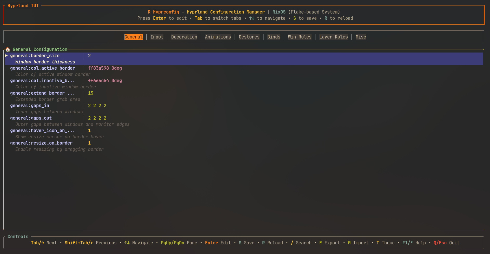
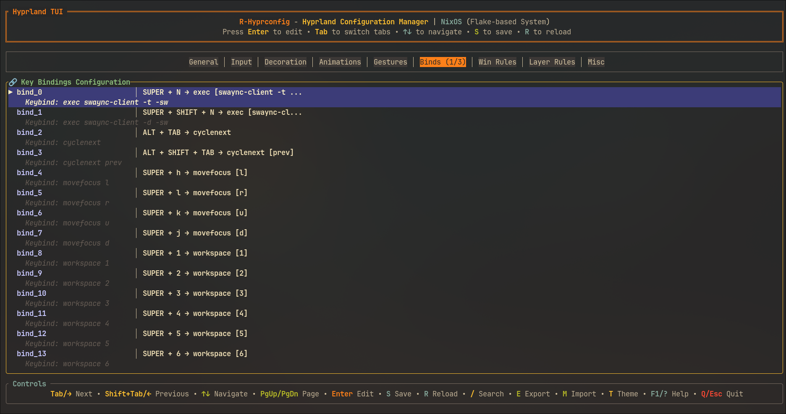
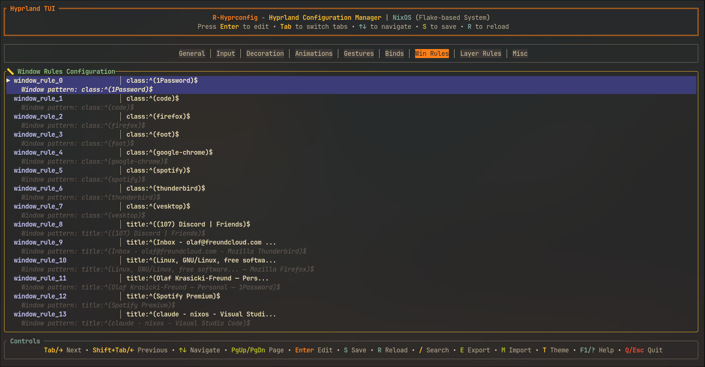
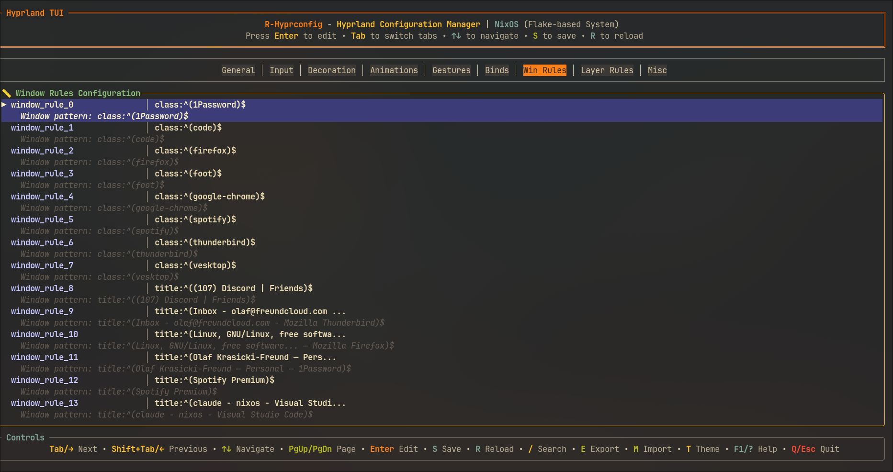

# r-hyprconfig

> Created with Claude Code assistance

A terminal user interface for managing Hyprland window manager configuration. Built in Rust with ratatui, it provides real-time configuration editing through hyprctl integration and supports both traditional Linux distributions and NixOS declarative workflows.

This tool emerged from the frustration of manually editing Hyprland configuration files and memorizing countless hyprctl commands. Instead of wrestling with syntax and hunting through documentation, you get an organized interface that lets you focus on actually configuring your desktop environment.



## Quick Start

```bash
# Install from GitHub releases
wget https://github.com/olafkfreund/r-hyprconfig/releases/download/v1.0.0/r-hyprconfig_v1.0.0_amd64.deb
sudo dpkg -i r-hyprconfig_v1.0.0_amd64.deb

# Or run with Nix
nix run github:olafkfreund/r-hyprconfig/v1.0.0

# Start configuring
r-hyprconfig
```

## What It Does

The core premise is simple: instead of memorizing hyprctl syntax and manually editing configuration files, you get a terminal interface that organizes all Hyprland options into logical panels. Each setting can be modified in real-time through hyprctl commands, with changes immediately visible in your window manager.

The interface groups related settings together. General settings cover window gaps, borders, and layouts. Input handles keyboard layouts and mouse behavior. Decoration manages visual effects like blur and rounding. Animations lets you tweak bezier curves and transition speeds. You get the idea.

What makes this tool particularly useful is its integration with different Linux deployment strategies. On traditional distributions, it manages your hyprland.conf file directly. On NixOS, it can export configurations in the declarative format that Nix expects, supporting everything from standalone Home Manager setups to full flake-based system configurations.

For system administrators managing multiple Hyprland installations, the batch configuration system lets you create profiles and deploy them across machines. Think of it as configuration as code, but with a friendly TUI instead of YAML hell.

The NixOS integration deserves special mention because it bridges the gap between imperative configuration (clicking buttons in a TUI) and declarative system management. You can prototype configurations visually, then export them as Nix expressions that integrate seamlessly with your system flakes.

## Real-World Usage

The tool serves different types of users with different workflows. A typical Hyprland user might open it to quickly adjust window gaps or test animation curves without editing configuration files directly. The search function (`/`) helps locate specific settings across all panels, and changes apply immediately through hyprctl.

System administrators managing multiple Hyprland workstations use the batch configuration features to maintain consistency. You can create standardized profiles for different team types (developers, designers, QA), then deploy them across machines using the batch operations. This eliminates the tedium of manually configuring each workstation and ensures everyone starts with optimal settings.

NixOS users get a unique workflow that bridges imperative and declarative configuration. You can prototype configurations visually in the TUI, then export them as proper Nix expressions that integrate with your system flakes. The tool handles the complexity of generating correct Nix syntax for different deployment scenarios - whether you're using standalone Home Manager, system-level configuration, or flake-based setups.

The generated Nix configuration includes proper flake inputs, Home Manager modules, and correctly structured Hyprland settings that integrate seamlessly with your existing Nix workflow. For users managing multiple machines or team environments, this eliminates the manual translation between TUI configuration and declarative system management.

## Screenshots

The interface organizes Hyprland configuration options into tabbed panels with keyboard navigation. The General panel handles core window management settings like gaps, borders, and layouts.


Configuration editing happens in-place with validation and immediate feedback. Changes apply through hyprctl without requiring restarts.



Multiple panels organize related settings logically. Input handles keyboard and mouse configuration, Decoration manages visual effects, Animations controls transition behavior.



The help system provides keyboard shortcuts and search functionality across all configuration options. Search with `/` to locate specific settings quickly.



## Installation

You need Hyprland v0.50.1 or later with hyprctl available in your PATH. The tool targets Linux x86_64 systems, though ARM64 works through source compilation.

**GitHub Releases**

Download prebuilt packages for common distributions:

```bash
# Debian/Ubuntu
wget https://github.com/olafkfreund/r-hyprconfig/releases/download/v1.0.0/r-hyprconfig_v1.0.0_amd64.deb
sudo dpkg -i r-hyprconfig_v1.0.0_amd64.deb

# Fedora/RHEL/CentOS  
sudo rpm -i r-hyprconfig-v1.0.0-1.x86_64.rpm
```

**From Source**

Requires Rust 1.70+ and standard development tools:

```bash
git clone https://github.com/olafkfreund/r-hyprconfig.git
cd r-hyprconfig
cargo build --release
sudo cp target/release/r-hyprconfig /usr/local/bin/
```

**With Nix**

Run directly without installation or add to your profile:

```bash
# Run directly
nix run github:olafkfreund/r-hyprconfig/v1.0.0

# Or install to profile
nix profile install github:olafkfreund/r-hyprconfig/v1.0.0
```

**NixOS Integration**

For NixOS system-level configuration:

```nix
{
  imports = [
    (builtins.getFlake "github:olafkfreund/r-hyprconfig").nixosModules.default
  ];
  
  programs.r-hyprconfig.enable = true;
}
```

For Home Manager configurations:

```nix
{
  imports = [
    (builtins.getFlake "github:olafkfreund/r-hyprconfig").homeManagerModules.default
  ];
  
  programs.r-hyprconfig = {
    enable = true;
    settings = {
      backup_enabled = true;
      auto_save = false;
      nixos_mode = true;
    };
  };
}
```

**Package Managers**

Available through various package ecosystems:

```bash
# AUR (Arch Linux)
yay -S r-hyprconfig-git

# Cargo (Rust package manager)
cargo install r-hyprconfig

# Homebrew (macOS/Linux)
brew install olafkfreund/tap/r-hyprconfig
```

## Usage

**Navigation** uses standard terminal patterns. `Tab` and arrow keys move between panels, while `↑` and `↓` navigate within panels. `Page Up`/`Page Down` scroll by screen, and `Home`/`End` jump to boundaries.

**Configuration management** centers around the `Enter` key to edit settings, `S` to save to file, and `R` to reload from Hyprland. Export configurations with `E` for TOML format or `N` for NixOS-compatible output. Import existing configurations with `M`.

**Advanced features** include batch management (`B`), theme cycling (`T`), search (`/`), and help overlay (`?` or `F1`). Press `Q` or `Esc` to quit.

**Search functionality** works across all configuration options. Press `/` and type terms like "gaps", "border", "animation", or "bind" to locate related settings quickly. The search updates results in real-time as you type.

**Configuration editing** adapts to the setting type. Text values get direct input with cursor support. Boolean values toggle with Space. Numeric values accept typed numbers. Select options use `↑`/`↓` for predefined choices. Keybinds get a special editor for modifier and key combinations.

## Configuration Panels

The interface organizes Hyprland settings into logical groups. **General** covers core window management like gaps, borders, layouts, and cursor behavior. **Input** handles keyboard layouts, mouse sensitivity, touchpad settings, and special key behaviors.

**Decoration** manages visual appearance including window rounding, blur effects, drop shadows, and opacity settings. **Animations** controls bezier curves, animation speeds, window transitions, and workspace animations.

**Gestures** configures touchpad gestures for workspace switching, window management, and custom commands. **Binds** manages keybindings for application launchers, window management shortcuts, workspace navigation, and custom commands.

**Window Rules** defines application-specific behavior including floating rules, size and position constraints, opacity and effects rules, and workspace assignments. **Layer Rules** handles layer-specific rendering for overlays, bars, panels, and z-order management.

**Misc** contains additional Hyprland options like logo display, debug settings, and experimental features.

## Advanced Features

**NixOS Integration**

The application automatically detects NixOS environments by checking for `/etc/NIXOS`, the `NIX_STORE` environment variable, `nixos-rebuild` command availability, and the Nix store directory. This enables seamless export of configurations in NixOS-compatible formats.

The tool supports four main NixOS configuration patterns. Home Manager standalone configurations work for users managing their environment independently of system configuration. System-level configurations integrate Hyprland at the NixOS level while keeping user settings in Home Manager. Flake-based Home Manager provides reproducible user environments with pinned inputs. Flake-based NixOS system configurations offer complete system reproducibility.

Each export type generates properly structured Nix expressions with correct module imports, input specifications, and settings formatting that integrates seamlessly with existing Nix workflows.

**Batch Configuration Management**

System administrators managing multiple Hyprland installations can create reusable profiles that capture complete configuration states. Profiles include automatic timestamping and descriptions, stored in `~/.config/r-hyprconfig/profiles/` for easy organization.

Batch operations include Apply (overlay profile settings on current configuration), Merge (intelligently combine profile with existing settings), Replace (completely substitute configuration with profile), and Backup (create safety copy before changes).

Common scenarios include new employee onboarding with standardized developer profiles, seasonal configuration updates with different themes, and team-specific optimizations for frontend developers, backend engineers, or QA teams with multi-monitor setups.

## Configuration Files

The application stores its configuration in `~/.config/r-hyprconfig/config.toml` with settings for Hyprland config path, backup preferences, NixOS mode, and theme selection. The NixOS section specifies export configuration type and output path, while the batch section configures profile storage and automatic backup behavior.

Profiles are stored in `~/.config/r-hyprconfig/profiles/` as timestamped TOML files with metadata. Exports go to `~/.config/r-hyprconfig/exports/` with separate subdirectories for TOML exports, NixOS exports, and automatic backups.

## Themes

Six built-in themes accommodate different visual preferences. Nord provides a cool blue/gray palette as the default. Dracula offers a dark purple vampire aesthetic. Gruvbox delivers warm retro colors. Tokyo Night presents a modern dark theme. Catppuccin features pastel dark tones. Solarized provides the classic scientific light/dark palette.

Theme switching happens with the `T` key to cycle through options, or by setting the theme preference in `config.toml`.

## Troubleshooting

**"hyprctl not found"** means Hyprland isn't installed or available in your PATH. Verify with `which hyprctl` - it should return a path like `/usr/bin/hyprctl`. Install Hyprland if missing.

**"Permission denied writing config"** indicates file permission issues with your Hyprland configuration. Check permissions with `ls -la ~/.config/hypr/hyprland.conf` and fix with `chmod 644 ~/.config/hypr/hyprland.conf` if needed.

**"NixOS export not available"** appears when running on non-NixOS systems. The NixOS export features require a NixOS environment. Use regular export (`E` key) instead.

**Configuration changes not taking effect** despite saving successfully usually requires manual reload. Try `hyprctl reload` or restart Hyprland entirely with your configured exit keybind.

**Debug mode** provides detailed logging for troubleshooting. Run `r-hyprconfig --debug` to see configuration file operations, hyprctl command execution, error stack traces, and performance metrics. Application logs are stored in `~/.local/share/r-hyprconfig/logs/` on Linux.

## Contributing

Development requires cloning the repository and setting up either a Nix development environment (`nix develop`) or traditional Rust toolchain (`cargo build`, `cargo test`, `cargo run -- --debug`).

The Nix flake provides a complete development environment with Rust toolchain (stable with rust-analyzer, clippy, rustfmt), development tools (cargo-watch, cargo-audit), system dependencies (pkg-config, OpenSSL), and pre-commit hooks for formatting, linting, and security audit.

Follow `cargo fmt` and `cargo clippy` recommendations for code style. Add tests for new functionality. Update documentation including README and inline docs. Use conventional commit messages.

Contribution areas include new themes and color schemes, additional Hyprland configuration options, platform testing on different distributions, enhanced TUI components, and documentation improvements with examples and tutorials.

## Roadmap

**Current Version (v1.0.0)** represents a stable release with complete TUI interface, real-time hyprctl integration, comprehensive validation, NixOS export functionality, batch configuration management, multi-theme support, search and filtering, automatic backup and restore, cross-distribution compatibility, and production-ready stability.

**Upcoming Features (v1.1.0)** include undo/redo functionality for configuration changes, configuration diff viewer and comparison tools, enhanced batch operations with scheduling, plugin system for custom modules, improved validation with contextual error messages, and configuration templates and presets.

**Future Plans (v1.2.0+)** envision remote configuration management via SSH, configuration synchronization between machines, integration with Hyprland theme repositories, visual timeline for configuration history, community configuration sharing platform, and advanced theming and customization tools.

## License

This project is licensed under the GNU Affero General Public License v3 (AGPL-3.0) - see the [LICENSE](LICENSE) file for details.

## Acknowledgments

Built with [Hyprland](https://hyprland.org/) as the target Wayland compositor, [ratatui](https://github.com/ratatui-org/ratatui) for the TUI framework, and [NixOS](https://nixos.org/) as inspiration for declarative configuration management. The Rust ecosystem provides the foundation for performance and reliability.

## Support

Report bugs or request features through [GitHub Issues](https://github.com/olafkfreund/r-hyprconfig/issues). Join [community discussions](https://github.com/olafkfreund/r-hyprconfig/discussions) for general questions. The Hyprland Discord community provides real-time help and configuration advice.